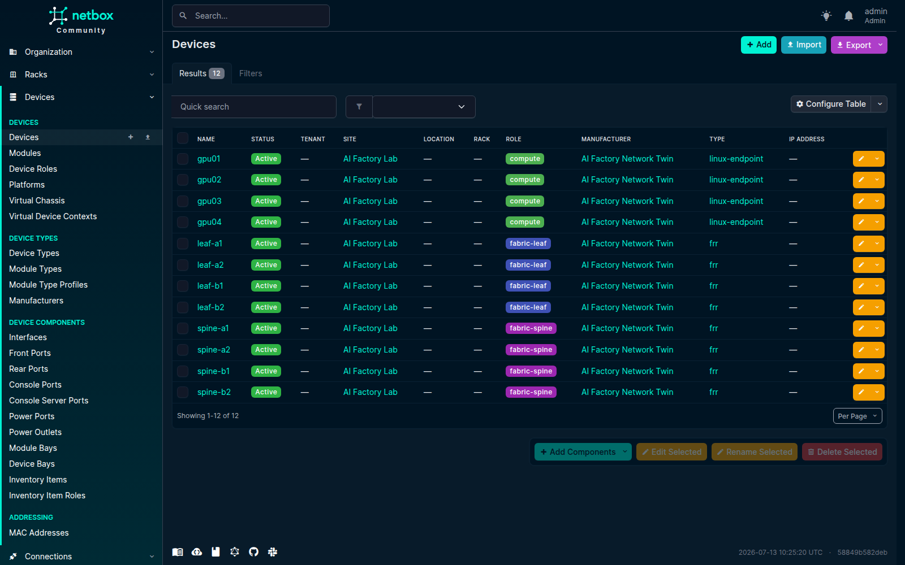
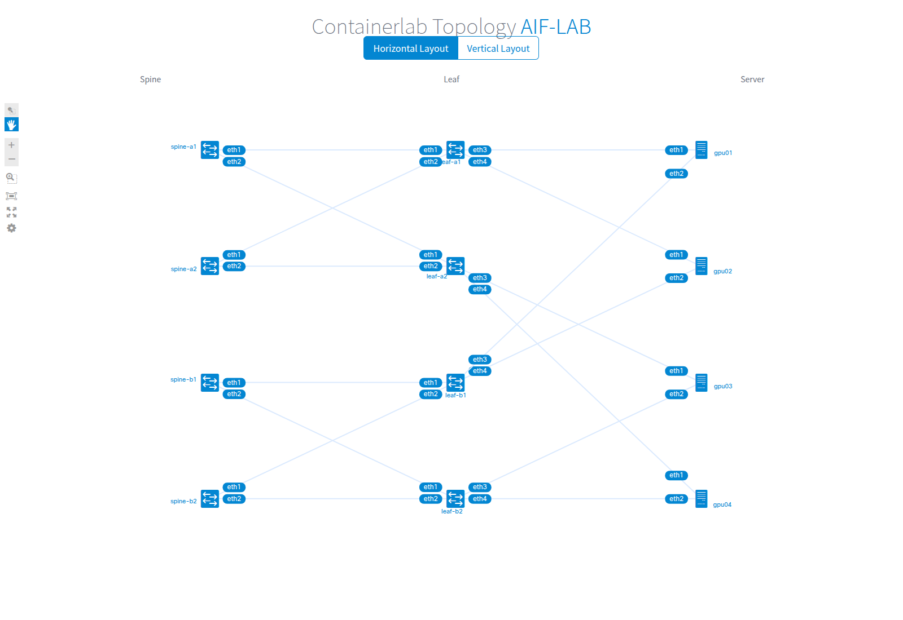
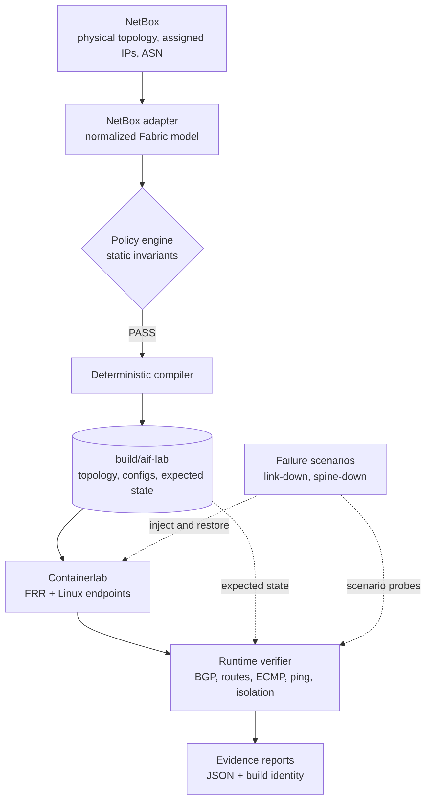

# AI Factory Network Twin

NetBox-driven AI cluster network digital twin and validation lab.

This repository turns a NetBox site into a deterministic, executable Containerlab fabric and then proves that the resulting control plane behaves as designed. The bundled lab models a dual-plane L3 Clos fabric with FRR routers, Linux GPU endpoints, eBGP, ECMP, per-plane VRFs, runtime verification, and reversible failure scenarios.

**Status:** functional MVP complete (`M0` through `M5`). See [`PLANNING.md`](PLANNING.md) for the product decisions and roadmap.

> This is a network intent and control-plane validation lab. It does not model GPU performance, RDMA, switch ASICs, buffers, PFC/ECN, or line-rate traffic.

## Start here

| Goal                          | Where to go                                   |
| ----------------------------- | --------------------------------------------- |
| Run everything once           | [`just demo`](#fastest-path-one-command-demo) |
| Learn the system step by step | [Guided walkthrough](#guided-walkthrough)     |
| Understand the architecture   | [How it works](#how-it-works)                 |
| Find a recipe                 | [Command reference](#command-reference)       |

The normal hands-on flow is:

```text
netbox-up → seed → validate → compile → graph → lab-up
                                               ↓
lab-down ← failure scenarios ← verify ← running digital twin
```

## What this repository demonstrates

- NetBox as the source of truth for devices, interfaces, cables, assigned interface addresses, ASNs, roles, tags, and fabric planes.
- Git as the source of truth for permitted address pools, prefix-length constraints, policy, platform mappings, renderers, golden fixtures, and failure scenarios.
- Static validation of dual-plane AI-fabric invariants before deployment.
- Deterministic generation of Containerlab, FRR, endpoint, expected-state, and manifest artifacts.
- A capability-declared platform backend contract: the same vendor-neutral fabric and
  expected state compile to FRR or Nokia SR Linux, and per-backend collectors normalize
  observed state for one verifier.
- Optional Batfish pre-deployment assurance that converts admitted answers into stable
  findings and disables itself explicitly on unsupported syntax.
- Runtime proof of BGP sessions, routes, ECMP, endpoint reachability, and cross-plane isolation.
- Reversible link and spine failure tests with machine-readable evidence.

## The lab at a glance

The development fixture seeds 12 devices into the local NetBox instance: four spines, four leaves, and four compute endpoints.



The same NetBox intent compiles into a Containerlab topology. `just graph` groups devices by role and supports both horizontal and vertical layouts.



## How it works



The project keeps ownership boundaries explicit:

| Owner | Data |
| --- | --- |
| NetBox | Physical devices, roles, interfaces, cables, assigned addresses, ASNs, and tags |
| Git | Address-pool and prefix-length policy, platform mappings, renderers, fixtures, and scenarios |
| `build/` | Reproducible topology, configuration, expected state, and reports |
| Containerlab | Ephemeral containers, links, interface state, BGP, and routes |

Compilation, deployment, and verification never write to NetBox. Only the development-only `seed` command creates fixture objects.

## Golden topology

The default `mini-dual-plane` fixture represents one site with independent fabric planes A and B.

| Role             |    Plane A |    Plane B | Total |
| ---------------- | ---------: | ---------: | ----: |
| Spine            |          2 |          2 |     4 |
| Leaf             |          2 |          2 |     4 |
| Compute endpoint | dual-homed | dual-homed |     4 |

Each leaf connects to every spine in its plane. Each compute endpoint has one interface in Plane A and one in Plane B, with the interfaces placed into separate Linux VRFs. The generated fabric uses eBGP and ECMP; there is no cross-plane routing path.

## Platform backends

Rendering, Containerlab node definitions, source-to-runtime interface naming, readiness
probes, and observed-state collection are owned by capability-declared platform backends.
Policy profiles state the capabilities they require, and compilation fails with the
complete gap list when a selected backend cannot satisfy them.

| Backend | Runtime | Collector | Profile inputs |
| --- | --- | --- | --- |
| `frr` | FRR in a plain Linux container | `vtysh` JSON | `config/policies/mini-dual-plane.yaml`, `config/platform-map.yaml` |
| `srlinux` | Native `nokia_srlinux` Containerlab node | `sr_cli` state queries as JSON | `config/policies/mini-dual-plane-srlinux.yaml`, `config/platform-map-srlinux.yaml` |
| `linux_endpoint` | Pinned local Linux VRF endpoint image | `ip vrf exec` ping probes | shared by both network profiles |

The SR Linux golden lab uses its own fixture, site, and address space, so both labs can
be seeded into one NetBox instance and run side by side:

```bash
uv run aftwin seed --fixture fixtures/mini-dual-plane-srlinux.yaml
uv run aftwin validate --site aif-srlinux --profile config/policies/mini-dual-plane-srlinux.yaml
uv run aftwin compile --site aif-srlinux \
  --profile config/policies/mini-dual-plane-srlinux.yaml \
  --platform-map config/platform-map-srlinux.yaml
uv run aftwin deploy --site aif-srlinux
uv run aftwin verify --site aif-srlinux
uv run aftwin lab down --site aif-srlinux
```

Expected state stays vendor-neutral: swapping only the platform map produces
byte-identical `expected-state.json` for FRR and SR Linux builds of the same fabric.
Deployment additionally checks that every required container image is present locally or
pullable before Containerlab creates any resource.

## Optional pre-deployment assurance (Batfish)

For backends that advertise the capability (currently FRR), `aftwin assure` analyzes
the compiled configuration in a local [Batfish](https://github.com/batfish/batfish)
service before anything is deployed:

```bash
just batfish-up
uv run aftwin assure --site aif-lab
just batfish-down
```

The admitted questions — a parse gate with an explicit benign-warning allowlist, BGP
session configuration and establishment prediction, forwarding-loop detection,
derived-RIB prefix and ECMP-width checks, and cross-plane route-leak rejection — are
converted into stable `BFA` findings (see `docs/policy-rules.md`) bound to the build
hash. If the generated syntax falls outside the validated allowlist the capability is
disabled explicitly instead of reporting partial assurance, and backends without the
capability (such as SR Linux) are rejected with an actionable error. Batfish answers
are derived evidence about generated configuration; the runtime verifier remains the
authority for observed state, and the baseline workflow never requires Batfish or its
optional `assure` dependency group.

## Requirements

Run the lab on a local Linux host with:

| Component                          | Requirement                           |
| ---------------------------------- | ------------------------------------- |
| Python                             | 3.12 or newer                         |
| [`uv`](https://docs.astral.sh/uv/) | Python environment and task execution |
| [`just`](https://just.systems/)    | Repository command runner             |
| Docker                             | Engine with the Compose CLI plugin    |
| Containerlab                       | 0.77.0 tested                         |

Docker and Containerlab require sufficient local privileges to create containers and network links. The first run pulls the pinned NetBox and FRR images and builds the local endpoint image.

## Fastest path: one-command demo

Clone the repository and prepare the Python environment:

```bash
git clone https://github.com/restack/ai-factory-network-twin.git
cd ai-factory-network-twin
cp .env.example .env
just bootstrap
```

Then run the complete disposable demonstration:

```bash
just demo
```

The demo performs the following sequence:

1. Starts the local, version-pinned NetBox environment.
2. Builds the Linux endpoint image.
3. Seeds the `mini-dual-plane` fixture.
4. Validates and compiles the fabric.
5. Deploys the Containerlab topology.
6. Verifies the healthy baseline.
7. Runs link and spine failure scenarios.
8. Verifies recovery.
9. Removes the lab and stops NetBox.

Cleanup is scoped and protected by a shell trap, including failed or interrupted runs. Use the guided workflow below if you want to inspect each stage in the browser and keep the lab running.

## Guided walkthrough

### 1. Bootstrap the repository

```bash
cp .env.example .env
just bootstrap
just check
```

`just bootstrap` installs all locked runtime and development dependencies. `just check` runs formatting checks, linting, strict type checking, and the unit/golden test suite.

### 2. Start the local NetBox source of truth

```bash
just netbox-up
```

Open <http://127.0.0.1:8000> and sign in with:

- Username: `admin`
- Password: `admin`

These are public, development-only credentials. The bundled service listens only on `127.0.0.1:8000` and must not be exposed or reused in production.

Check service health at any time:

```bash
docker compose -f deploy/netbox/docker-compose.yml ps
```

### 3. Seed the golden fixture

```bash
just seed
just seed  # safe to repeat; no duplicate objects are created
```

The fixture creates the site, roles, platforms, devices, interfaces, cables, assigned IP addresses, and ASN associations required by the lab. It does not create NetBox Prefix objects: the current MVP keeps permitted address pools and required prefix lengths in the Git-owned policy profile. Refresh the NetBox device list to inspect the 12-device inventory shown above.

For a smaller development slice, use:

```bash
just seed-smoke
```

Seeding is intentionally restricted to loopback NetBox URLs. Supplying a non-loopback URL requires an explicit CLI override so the development fixture cannot be written to an external NetBox accidentally.

### 4. Validate network intent before deployment

```bash
just validate
```

Expected result for the golden fixture:

```text
Static validation: PASS
Findings: 0 error(s), 0 warning(s), 0 info
```

The policy engine checks, among other rules:

- Required devices, roles, platforms, tags, loopbacks, and ASNs
- Unique interface addresses, ASNs, and cable endpoints
- Plane membership and cross-plane cabling
- One independent host interface per required plane
- Full leaf-to-spine connectivity within each plane
- Point-to-point subnet and address-pool correctness

Rule IDs and remediation contracts are documented in [`docs/policy-rules.md`](docs/policy-rules.md). Validation fails before any runtime is created and reports all discovered findings together.

### 5. Compile a deterministic digital twin

```bash
just compile
```

The compiler fetches a fresh allowlisted NetBox snapshot, normalizes it, re-runs static validation, and writes `build/aif-lab/`.

| Artifact                         | Purpose                                              |
| -------------------------------- | ---------------------------------------------------- |
| `source/netbox.json`             | Allowlisted source snapshot used for the build       |
| `inventory.json`                 | Normalized fabric inventory                          |
| `reports/static-validation.json` | Machine-readable policy evidence                     |
| `topology.clab.yml`              | Deployable Containerlab topology                     |
| `configs/routers/*`              | FRR daemon and startup configuration                 |
| `configs/endpoints/*`            | Linux VRF and endpoint setup scripts                 |
| `expected-state.json`            | Expected BGP, routes, paths, and reachability        |
| `manifest.json`                  | Source, policy, platform, compiler, and artifact identity |

Compiling unchanged source produces byte-stable files and the same build hash. Deploy refuses missing, stale, or manifest-inconsistent artifacts.

### 6. Visualize the compiled topology

Run the graph server in a separate terminal:

```bash
just graph
```

Open <http://127.0.0.1:50080>. The graph can be used before deployment; after deployment, Containerlab also enriches it with runtime container metadata. The graph server reads a topology snapshot at startup, so restart `just graph` after recompiling.

The server runs in the foreground and stops with `Ctrl+C`. If port `50080` is occupied, choose another loopback port:

```bash
just graph aif-lab 127.0.0.1:50081
```

This view shows structural topology. Failure scenarios change interface and routing state, but the physical links remain wired and are not colored by health in the current MVP.

### 7. Build the endpoint image and deploy the lab

```bash
just endpoint-image
just lab-up
```

The generated topology uses pinned, versioned images:

- `quay.io/frrouting/frr:10.3.4`
- `aftwin-endpoint:0.1.0`

The deployment path first verifies static policy evidence, source identity, manifest consistency, and platform compatibility. It then creates four FRR spines, four FRR leaves, and four Linux endpoints in Containerlab. After a successful inspection it atomically records `build/aif-lab/runtime/deployment.json`; runtime verification and failure scenarios refuse to run unless that stamp, the current manifest, topology, source revision, and exact running container set all agree.

### 8. Verify the running control plane

```bash
just verify
```

Expected result for the bundled topology:

```text
Runtime verification: PASS
bgp-sessions: 8/8 passed [PASS]
cross-plane-isolation: 32/32 passed [PASS]
reachability-plane-a: 12/12 passed [PASS]
reachability-plane-b: 12/12 passed [PASS]
routes: 32/32 passed [PASS]
Result: PASS
```

This is stronger evidence than a successful container deployment. The verifier compares observed BGP sessions, installed routes and paths, per-plane endpoint reachability, and forbidden cross-plane reachability against `expected-state.json`.

The report is written to:

```text
build/aif-lab/reports/runtime-verification.json
```

#### Inspect a real ECMP route

`just verify` automates the assertions, but you can also inspect the FRR RIB directly. On `leaf-a1`, query the remote host-link subnet originated by `leaf-a2`:

```bash
docker exec clab-aif-lab-leaf-a1 \
  vtysh -c 'show ip route 10.0.1.4/31' 2>/dev/null
```

The running lab installs two equal-cost next hops, one through each Plane A spine:

```text
Routing entry for 10.0.1.4/31
  Known via "bgp", distance 20, metric 0, best
  * 10.0.0.0, via eth1, weight 1
  * 10.0.0.4, via eth2, weight 1
```

Both starred next hops are installed in the forwarding table. This is the path redundancy exercised by the link and spine failure scenarios. To inspect every BGP-learned route or the two live neighbors, run:

```bash
docker exec clab-aif-lab-leaf-a1 vtysh -c 'show ip route bgp' 2>/dev/null
docker exec clab-aif-lab-leaf-a1 vtysh -c 'show bgp ipv4 unicast summary' 2>/dev/null
```

### 9. Inject reversible failures

Disable one Plane A leaf-to-spine link and prove that ECMP redundancy preserves reachability:

```bash
just scenario-link
```

The bundled scenario produces evidence shaped like:

```text
Failure scenario leaf-spine-link-failure: PASS
Failure: link-down target=leaf-a1 interfaces=eth1
before: 96/96 probes passed [PASS]
during: 57/57 probes passed [PASS]
recovery: 96/96 probes passed [PASS]
Restoration: PASS
Result: PASS
```

Then isolate one Plane A spine and prove that the remaining spine carries the plane:

```bash
just scenario-spine
```

Each scenario records the healthy baseline, applies the failure, checks the required surviving paths, restores every interface in a `finally` path, and verifies full recovery. Evidence is stored under:

```text
build/aif-lab/reports/scenarios/
```

Every scenario report identifies the scenario revision, source revision, and build hash. Recompilation clears reports from an older build so stale evidence cannot be confused with current results.

### 10. Clean up

Remove only the matching Containerlab instance and its runtime directory:

```bash
just lab-down
```

Stop NetBox while preserving its database:

```bash
just netbox-down
```

Delete the local NetBox database and all fixture state only when explicitly needed:

```bash
just netbox-reset
```

## Command reference

Run `just` to print the available recipes.

| Command                  | Purpose                                                    |
| ------------------------ | ---------------------------------------------------------- |
| `just bootstrap`         | Install locked Python runtime and development dependencies |
| `just check`             | Run formatting checks, lint, Pyright, and tests            |
| `just netbox-up`         | Start and health-check the local NetBox stack              |
| `just netbox-down`       | Stop NetBox and preserve its database                      |
| `just netbox-reset`      | Stop NetBox and delete local fixture volumes               |
| `just seed`              | Idempotently seed the golden NetBox fixture                |
| `just seed-smoke`        | Seed the smaller smoke fixture                             |
| `just validate`          | Validate NetBox intent against the fabric policy           |
| `just compile`           | Generate deterministic lab and expected-state artifacts    |
| `just graph`             | Serve the role-aware topology at port 50080                |
| `just endpoint-image`    | Build the pinned local Linux endpoint image                |
| `just batfish-up`        | Start the pinned local Batfish assurance service           |
| `just assure`            | Run optional Batfish pre-deployment assurance              |
| `just batfish-down`      | Stop the local Batfish assurance service                   |
| `just lab-up`            | Deploy a validated, manifest-consistent build              |
| `just verify`            | Verify BGP, routes, ECMP, reachability, and isolation      |
| `just scenario-link`     | Test one leaf-to-spine link failure and recovery           |
| `just scenario-spine`    | Test one spine failure and recovery                        |
| `just lab-down`          | Destroy the matching lab and runtime directory             |
| `just test-netbox`       | Run the local NetBox integration suite                     |
| `just test-containerlab` | Run the privileged Containerlab integration suite          |
| `just test-srlinux`      | Run the privileged SR Linux backend integration suite      |
| `just test-batfish`      | Run the Batfish assurance integration suite                |
| `just demo`              | Run the complete disposable end-to-end demonstration       |

## Safety and reproducibility contracts

- **Read-only production path:** validate, compile, deploy, verify, and scenarios never mutate NetBox.
- **Local fixture boundary:** the development NetBox binds to loopback and uses intentionally public credentials.
- **Fail before deploy:** invalid cabling, addressing, ASNs, roles, or planes prevent compilation and deployment.
- **Versioned runtime:** platform images must use explicit version tags; unversioned and `latest` references are rejected.
- **Build/runtime identity:** the manifest includes the source, policy profile, platform map, compiler, and generated artifacts; verify and scenario reports bind that build to the exact deployed container set.
- **Scoped lifecycle:** cleanup targets only the selected site and build.
- **Guaranteed restoration:** failure scenarios restore modified interfaces even when a probe or verification step fails.

## Testing

Run the unprivileged development suite:

```bash
just check
```

Run the local NetBox integration tests:

```bash
just test-netbox
```

Run the privileged Containerlab integration tests:

```bash
just test-containerlab
just test-srlinux
```

Each Containerlab test deploys an ephemeral topology and always destroys it in a `finally` cleanup path. The SR Linux suite pulls the public `ghcr.io/nokia/srlinux` image on first use.

Run the Batfish assurance integration tests against the pinned local service:

```bash
just batfish-up
just test-batfish
just batfish-down
```

The weekly and manually dispatched [privileged E2E workflow](.github/workflows/e2e.yml) runs the integration suites and the complete disposable demonstration on a self-hosted Linux runner labeled `privileged`, with Docker and Containerlab access. It uploads the compiled topology, manifest, expected state, and JSON verification and scenario reports, then removes the lab and local NetBox volumes in an unconditional cleanup step. The bundled workflow uses only the public FRR and SR Linux images and the locally built endpoint image; it does not require proprietary NOS images.

## Troubleshooting

| Symptom                              | Check                                                                                      |
| ------------------------------------ | ------------------------------------------------------------------------------------------ |
| NetBox does not open                 | Run `docker compose -f deploy/netbox/docker-compose.yml ps` and wait for `healthy`         |
| `just graph` shows an older topology | Stop it with `Ctrl+C`, run `just compile`, then start `just graph` again                   |
| Port 50080 is busy                   | Run `just graph aif-lab 127.0.0.1:50081`                                                   |
| Endpoint image is missing            | Run `just endpoint-image` before `just lab-up`                                             |
| Deploy rejects the build             | Re-run `just validate` and `just compile`; do not edit generated files                     |
| Runtime verification fails           | Inspect `build/aif-lab/reports/runtime-verification.json` and the relevant container state |

## Scope and non-goals

The MVP validates an L3 Clos control plane and minimum endpoint connectivity. It intentionally does not claim to reproduce:

- GPU, CUDA, NCCL, or distributed-training performance
- InfiniBand credit behavior or NVLink/NVSwitch
- RoCE NIC offload, PFC, ECN, DCQCN, or switch buffer behavior
- Adaptive routing, packet spraying, or 400G/800G line-rate performance
- Production configuration push or bidirectional NetBox synchronization
- A general-purpose multi-vendor topology exporter

EVPN/VXLAN, telemetry, drift detection, SR Linux, multiple sites, DCI, and workload traffic profiles remain post-MVP candidates.

## Further reading

- [`PLANNING.md`](PLANNING.md) — product thesis, architecture, milestones, and roadmap
- [`docs/DIGITAL_TWIN_ARCHITECTURE.md`](docs/DIGITAL_TWIN_ARCHITECTURE.md) — post-MVP multi-vendor, assurance, secure-edge, and fidelity design
- [`docs/RESEARCH.md`](docs/RESEARCH.md) — background research and design context
- [`docs/policy-rules.md`](docs/policy-rules.md) — stable validation rule catalog
- [`deploy/netbox/README.md`](deploy/netbox/README.md) — local NetBox lifecycle and security boundary
- [`docs/GOAL.md`](docs/GOAL.md) — implementation goal and delivery workflow
